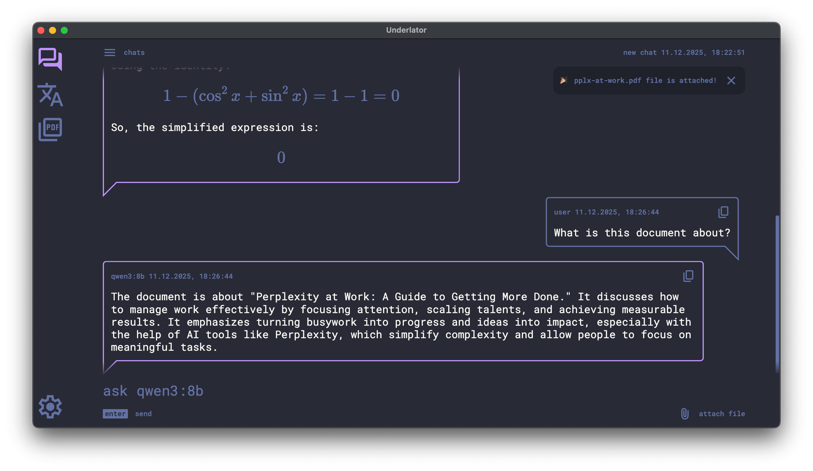
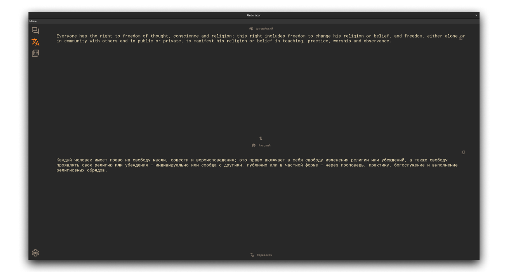
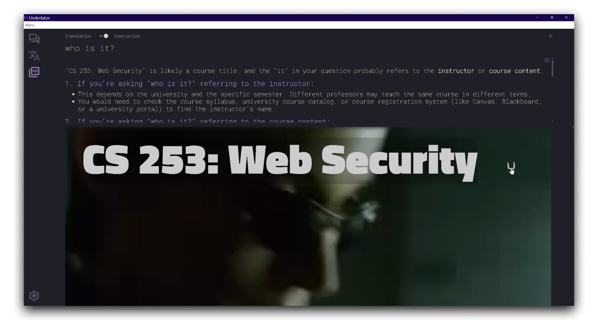
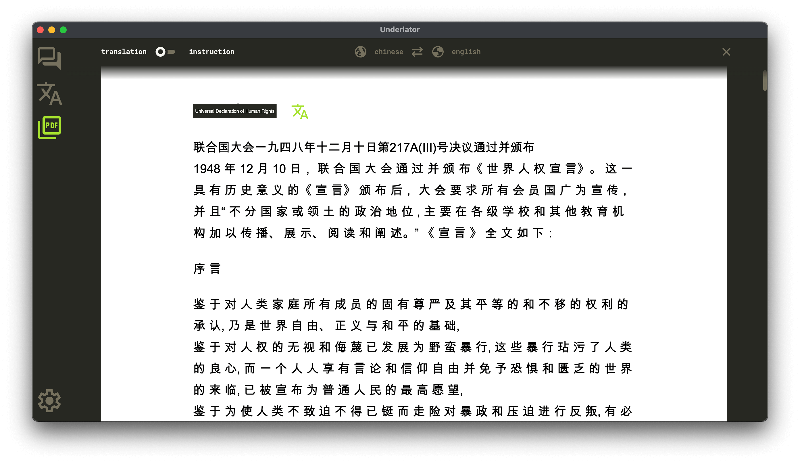
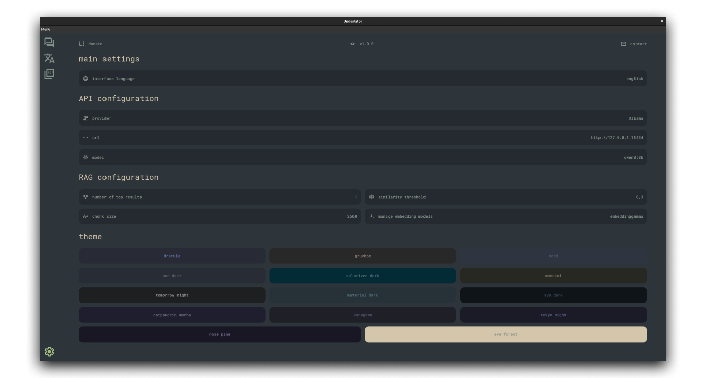

    

<h1 align="center">Underlator</h1>

Desktop application for working with local LLMs: text and document translation, interactive chat, intelligent document analysis.

[![license][license-image]][license-url]
[![release][release-image]][release-url]

English &nbsp;&nbsp;|&nbsp;&nbsp; [Russian](README_RU.md)

[license-image]: https://img.shields.io/badge/license-BSD--3--Clause%20%2B%20Branding-7D6EDE.svg

[license-url]: https://github.com/Sengeer/underlator/blob/main/LICENSE

[release-image]: https://img.shields.io/github/v/release/underlator/underlator.svg

[release-url]: https://github.com/Sengeer/underlator/releases/latest

## ✨ Features

- 🦙 **Local LLM models** — automatic Ollama installation and management;
- 🤔 **Support thinking models** — work with models that support the thinking process;
- 💬 **Interactive chat** — full-featured chat with message history;
- 🔍 **Intelligent document analysis (RAG)** — ask questions about documents and get answers based on their content;
- 📝 **Text translator** — quick translation of plain text;
- 🕹️ **PDF document handling** — view, translate, and analyze PDF files;
- 📄 **PDF working modes**:
  - Instruction mode — ask questions about the document;
  - Document translation mode — automatic translation of PDF content;
- 🤫 **Full confidentiality** — all data is processed locally, without sending to the internet;
- 📲 **Convenient interface** — minimalist design;
- 🎨 **Customizable themes** — choose your color scheme;
- 🚀 **Fully autonomous application** — works without internet connection.

## 📸 Screenshots

**Chat**

**Text translation**

**Interaction in PDF**

**Document translation**

**Settings**

## 🔒 Security and Confidentiality

Underlator is designed for working with sensitive data:

- ✅ **Local LLMs only** — all processing happens on your computer
- ✅ **Local storage** — all data is stored only on your device
- ✅ **No internet required** — the application works completely autonomously
- ✅ **No external requests** — your documents and messages never leave your computer

## 🗑️ Uninstall

Application data (chats, RAG vectors, and other files) is stored in the standard Electron userData directory:

- **macOS**: `~/Library/Application Support/Underlator/`
- **Linux**: `~/.config/Underlator/`
- **Windows**: `%APPDATA%\Underlator\` (typically `C:\Users\<username>\AppData\Roaming\Underlator\`)

To completely remove the application, delete this directory after uninstalling the application itself.

## 📄 License

BSD-3-Clause + Branding (see [LICENSE](LICENSE))

## 👤 Author

Sengeer