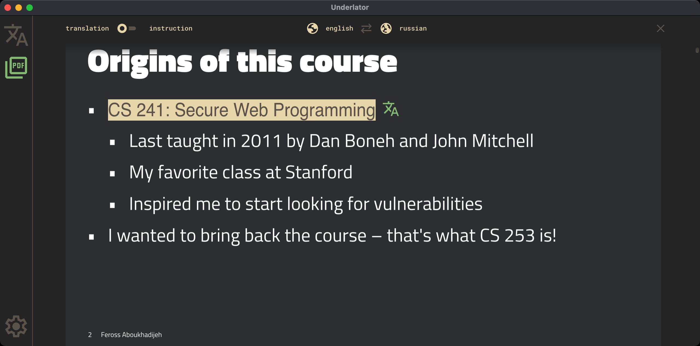
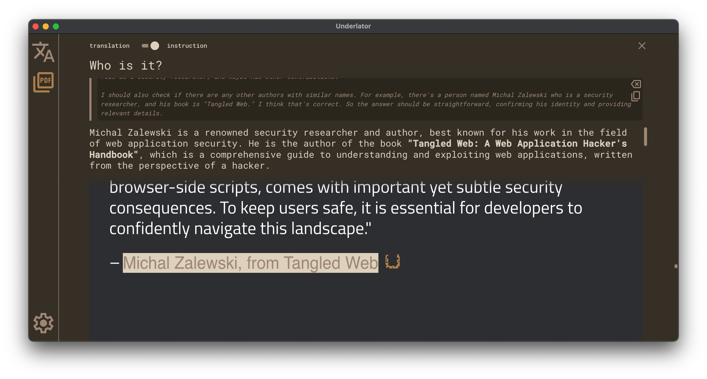

    

<h1 align="center">Underlator</h1>

Confidential translator and interactive assistant for document analysis using local LLMs — as a desktop application.

[![license][license-image]][license-url]
[![release][release-image]][release-url]

English &nbsp;&nbsp;|&nbsp;&nbsp; [Russian](README_RU.md)

[license-image]: https://img.shields.io/badge/license-MIT-7D6EDE.svg

[license-url]: https://github.com/Sengeer/underlator/blob/main/LICENSE

[release-image]: https://img.shields.io/github/v/release/underlator/underlator.svg

[release-url]: https://github.com/Sengeer/underlator/releases/latest

## ✨ Features

- 🦙 Ollama provider support;
- 🤔 Support thinking models;
- 🕹️ Document translator and interactive PDF viewer;
- 📄 PDF viewer includes instruction mode (for custom prompting) and document translation mode;
- 🤫 Model requests and responses are not stored anywhere except in RAM 😅;
- 📲 Convenient, minimalist, in-house designed UI;
- 🎨 Customizable color scheme.

## 🔍 Preview

**Ollama text translation**

**Interaction with model**

**Ollama document translation**

