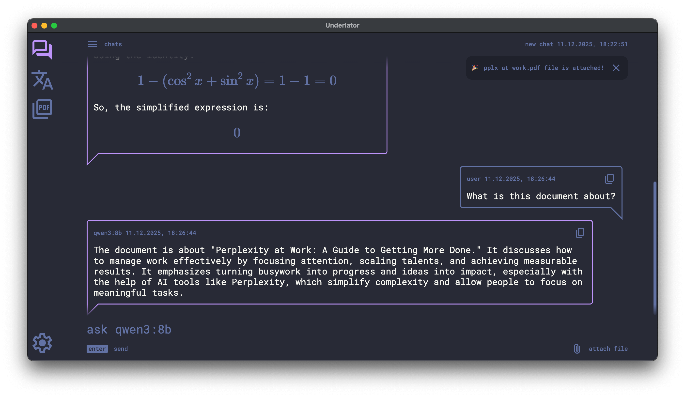
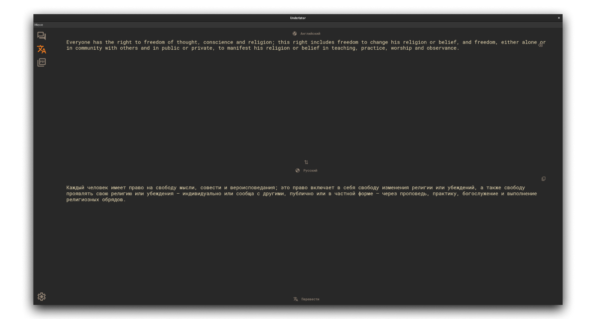
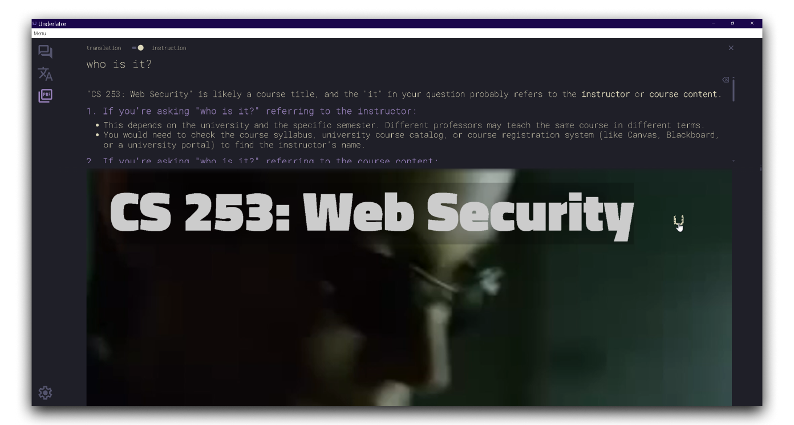
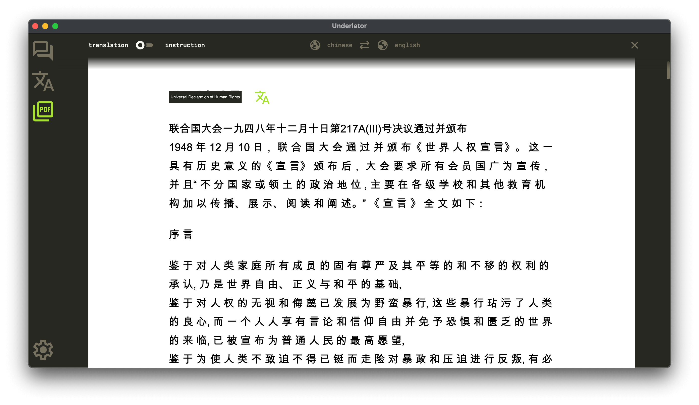
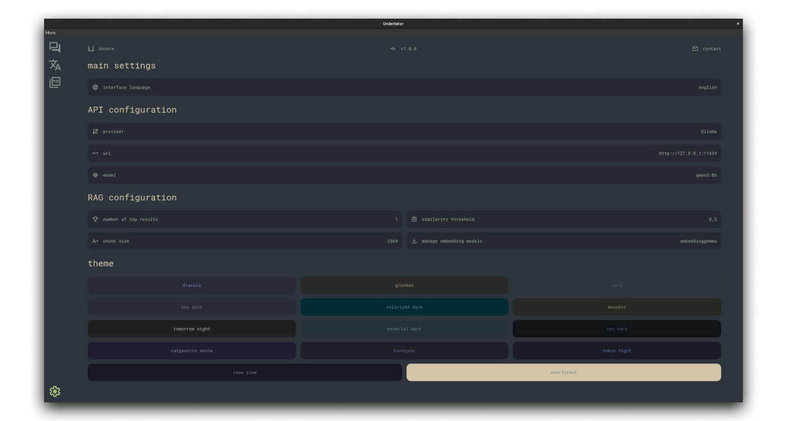

    

<h1 align="center">Underlator</h1>

Desktop application for working with local LLMs: text and document translation, interactive chat, intelligent document analysis.

[![license][license-image]][license-url]
[![release][release-image]][release-url]

English &nbsp;&nbsp;|&nbsp;&nbsp; [Russian](README_RU.md)

Inspired by [Monkeytype](https://monkeytype.com/). Powered by [Ollama](https://ollama.com/).

[license-image]: https://img.shields.io/badge/license-BSD--3--Clause%20%2B%20Branding-7D6EDE.svg

[license-url]: https://github.com/sengeer/underlator/blob/main/LICENSE

[release-image]: https://img.shields.io/github/v/release/sengeer/underlator.svg

[release-url]: https://github.com/sengeer/underlator/releases/latest

## ✨ Features

- 🦙 **Local LLM models** — automatic Ollama installation and management;
- 🤔 **Support thinking models** — work with models that support the thinking process;
- 💬 **Interactive chat** — full-featured chat with message history;
- 🔍 **Intelligent document analysis (RAG)** — ask questions about documents and get answers based on their content;
- 📝 **Text translator** — quick translation of plain text;
- 🕹️ **PDF document handling** — view, translate, and analyze PDF files;
- 📄 **PDF working modes**:
  - Instruction mode — ask questions about the document;
  - Document translation mode — automatic translation of PDF content;
- 🤫 **Full confidentiality** — all data is processed locally, without sending to the internet;
- 📲 **Convenient interface** — minimalist design;
- 🎨 **Customizable themes** — choose your color scheme;
- 🚀 **Fully autonomous application** — works without internet connection.

## ⚙️ Initial Setup

### Using Pre-installed Ollama

> **Note:** The external Ollama provider is disabled on macOS due to Gatekeeper restrictions that block local network requests. In the future, we plan to pay for an Apple subscription to sign and notarize the code.

If you already have external Ollama installed and running, select the **Ollama** provider in **API configuration** and manually specify the URL and model.

### Using Embedded Ollama

If Ollama was automatically downloaded when you first launched the application, select the **Embedded Ollama** provider in **API configuration** and download your desired model using the **manage models** button.

### RAG Configuration

To use RAG (intelligent document analysis), download an embedding model via **manage embedding models** in **RAG configuration** and adjust the RAG settings as needed.

## 📸 Screenshots

**Chat**

**Text translation**

**Interaction in PDF**

**Document translation**

**Settings**

## 🖥️ Desktop Tauri (Rust dual-mode)

Native desktop host on Tauri 2 (alongside the temporary Electron app and the Docker server mode): build/run commands, OS prerequisites, canonical release artifacts (Linux AppImage, macOS arm64 DMG, Windows portable zip), and the verification matrix are in [docs/DESKTOP_TAURI.md](docs/DESKTOP_TAURI.md). Electron remains until atom 6.1 after the Fedora AppImage gate closes.

## 🔒 Security and Confidentiality

Underlator is designed for working with sensitive data:

- ✅ **Local LLMs only** — all processing happens on your computer
- ✅ **Local storage** — all data is stored only on your device
- ✅ **No internet required** — the application works completely autonomously
- ✅ **No external requests** — your documents and messages never leave your computer

## 🗑️ Uninstall

Application data (chats, RAG vectors, and other files) is stored in the standard Electron userData directory:

- **macOS**: `~/Library/Application Support/Underlator/`
- **Linux**: `~/.config/Underlator/`
- **Windows**: `%APPDATA%\Underlator\` (typically `C:\Users\<username>\AppData\Roaming\Underlator\`)

To completely remove the application, delete this directory after uninstalling the application itself.

## 📄 License

BSD-3-Clause + Branding (see [LICENSE](LICENSE))

## 👤 Author

sengeer
