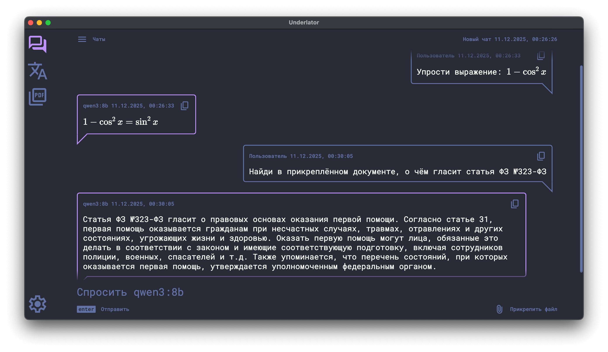
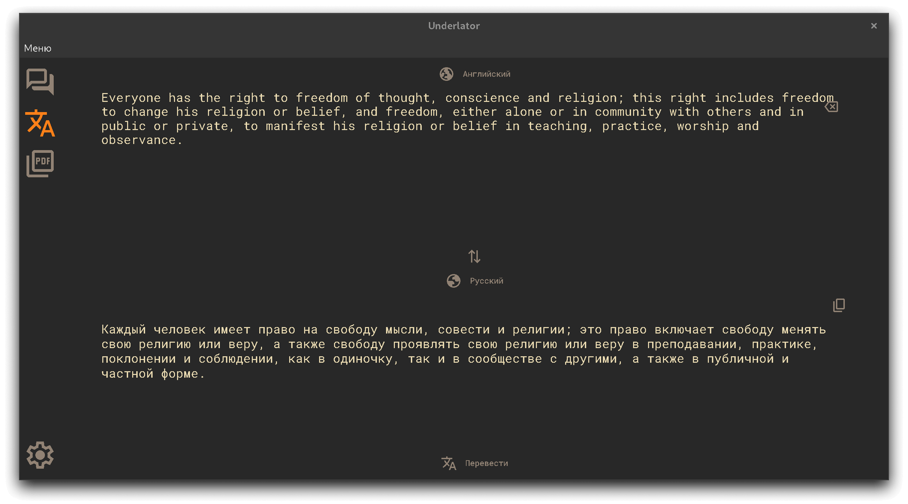
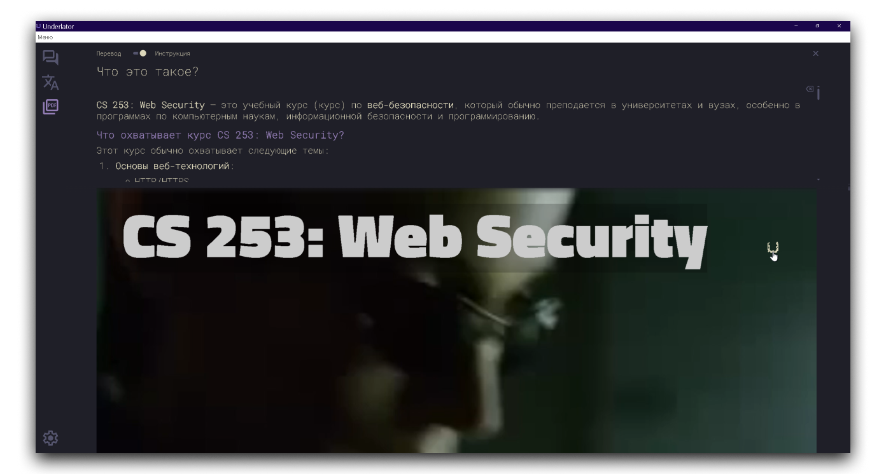
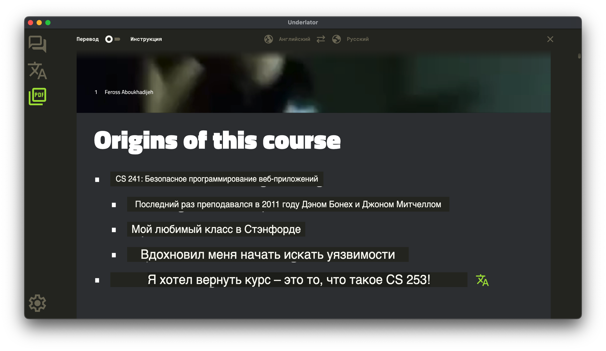
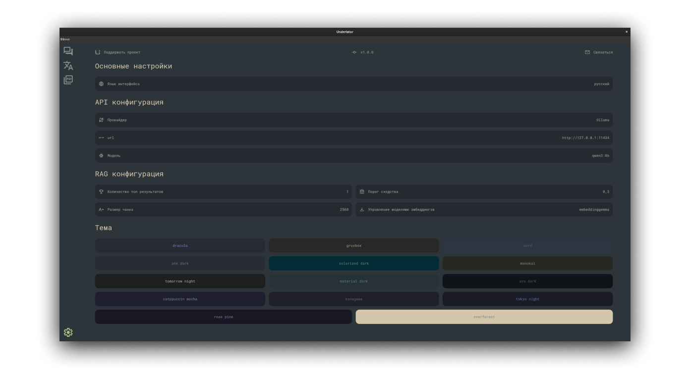

    

<h1 align="center">Underlator</h1>

Десктопное приложение для работы с локальными LLM: перевод текста и документов, интерактивный чат, интеллектуальный анализ документов.

[![license][license-image]][license-url]
[![release][release-image]][release-url]

[Английский](README.md) &nbsp;&nbsp;|&nbsp;&nbsp; Русский

[license-image]: https://img.shields.io/badge/license-BSD--3--Clause%20%2B%20Branding-7D6EDE.svg

[license-url]: https://github.com/Sengeer/underlator/blob/main/LICENSE

[release-image]: https://img.shields.io/github/v/release/underlator/underlator.svg

[release-url]: https://github.com/Sengeer/underlator/releases/latest

## ✨ Особенности

- 🦙 **Работа с локальными LLM моделями** — автоматическая установка и управление Ollama;
- 🤔 **Поддержка думающих моделей** — работа с моделями, поддерживающими процесс размышления;
- 💬 **Интерактивный чат** — полнофункциональный чат с сохранением истории сообщений;
- 🔍 **Интеллектуальный анализ документов (RAG)** — задавайте вопросы по документам, получайте ответы на основе их содержимого;
- 📝 **Переводчик текста** — быстрый перевод обычного текста;
- 🕹️ **Работа с PDF-документами** — просмотр, перевод и анализ PDF файлов;
- 📄 **Режимы работы с PDF**:
  - Режим инструкции — задавайте вопросы по документу;
  - Режим переводчика — автоматический перевод содержимого PDF;
- 🤫 **Полная конфиденциальность** — все данные обрабатываются локально, без отправки в интернет;
- 📲 **Удобный интерфейс** — минималистичный дизайн;
- 🎨 **Настраиваемые темы** — выбор цветовой схемы оформления;
- 🚀 **Полностью автономное приложение** — работает без подключения к интернету.

## 📸 Скриншоты

**Чат**

**Перевод текста**

**Взаимодействие в PDF**

**Перевод документа**

**Настройки**

## 🔒 Безопасность и конфиденциальность

Underlator разработан для работы с чувствительными данными:

- ✅ **Только локальные LLM** — все обработка происходит на вашем компьютере
- ✅ **Локальное хранение** — все данные хранятся только на вашем устройстве
- ✅ **Без интернета** — приложение работает полностью автономно
- ✅ **Никаких внешних запросов** — ваши документы и сообщения никогда не покидают ваш компьютер

## 📄 Лицензия

BSD-3-Clause + Branding (см. [LICENSE](LICENSE))

## 👤 Автор

Sengeer