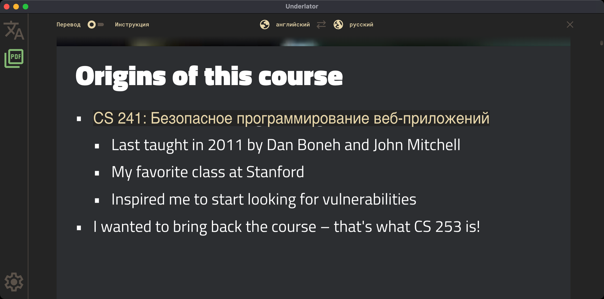
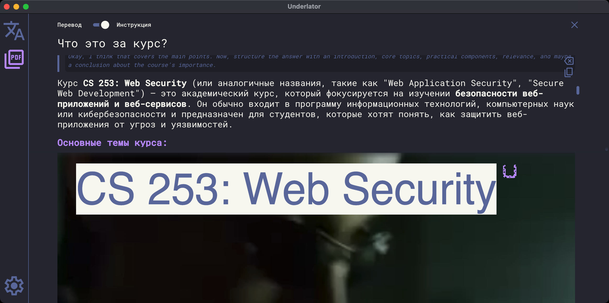

    

<h1 align="center">Underlator</h1>

Конфиденциальный переводчик и интерактивный помощник для анализа документов с использованием локальных LLM — в формате десктопного приложения.

[![license][license-image]][license-url]
[![release][release-image]][release-url]

[Английский](README.md) &nbsp;&nbsp;|&nbsp;&nbsp; Русский

[license-image]: https://img.shields.io/badge/license-MIT-7D6EDE.svg

[license-url]: https://github.com/Sengeer/underlator/blob/main/LICENSE

[release-image]: https://img.shields.io/github/v/release/underlator/underlator.svg

[release-url]: https://github.com/Sengeer/underlator/releases/latest

## ✨ Особенности

- 🦙 Поддержка провайдера Ollama;
- 🤔 Поддержка думающих моделей;
- 🕹️ Переводчик и интерактивный просмотр PDF-документов;
- 📄 Средство просмотра PDF-документов включает режим инструкции (для пользовательского промптинга) и режим переводчика документа;
- 🤫 Обращения к моделям и ответы нигде не сохраняются, кроме оперативной памяти 😅;
- 📲 Удобный минималистичный пользовательский интерфейс;
- 🎨 Настраиваемая цветовая схема.

## 🔍 Предварительный просмотр

**Перевод текста Ollama**

**Взаимодействие с моделью**

**Перевод документа Ollama**

